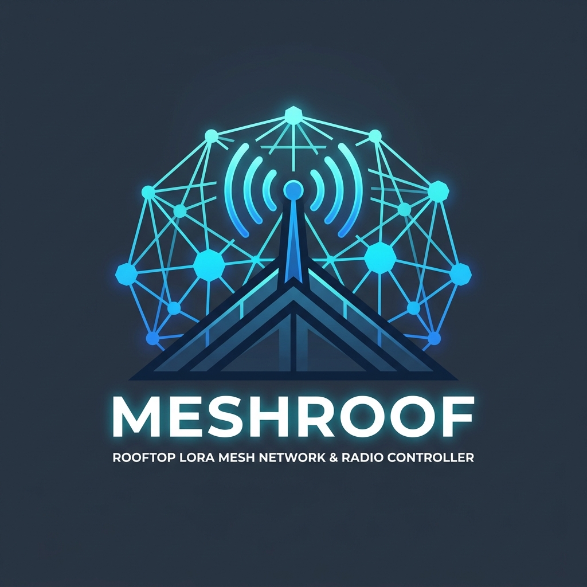

<p align="center">
  
</p>

<h1 align="center">MeshRoof</h1>

<p align="center">
  <b>Rooftop ESP32-S3 + Meshtastic LoRa Bridge & RF Station Controller</b>
</p>

<p align="center">
  
  
  
  
</p>

---

## Overview

**MeshRoof** is an embedded controller firmware for rooftop radio transceiver stations. It bridges an **ESP32-S3** microcontroller (e.g. Seeed XIAO ESP32-S3) with a **Meshtastic** LoRa device (e.g. Heltec V3) over UART.

Operating as a node on the Meshtastic mesh network, MeshRoof receives direct messages and broadcasts using the **HomeChat** protocol to control RF front-ends, manage power amplifiers, perform acoustic signaling, and report environmental diagnostics. With integrated WiFi and FreeRTOS networking, MeshRoof also provides remote management via USB Serial and TCP/Telnet shells.

---

## Key Features

- **Meshtastic & HomeChat Integration**: Full communication bridge using `libmeshtastic` and `HomeChat`, supporting node discovery, encrypted DM handling, and telemetry.
- **RF Power Amplifier & Antenna Control**: GPIO-driven switching for external bi-directional Power Amplifiers (PA) / Low-Noise Amplifiers (LNA) and antenna paths.
- **Dual Console Management**: Interactive command shells available over both USB Serial/JTAG and TCP socket (port `16876`), complete with `-h`/`--help` documentation and telnet IAC control.
- **Persistent NVM Configuration**: Onboard flash storage (NVS) for WiFi credentials, static/DHCP IP configurations, authentication channels, and administrator keys.
- **Acoustic & Morse Code Signaling**: Hardware buzzer support for audible alert tones and queued Morse code string playback.
- **Network Diagnostics & Ping**: Integrated ICMP ping utility and network status queries accessible via shell and HomeChat.
- **System Telemetry & Monitoring**: Hardware reset counter, uptime tracking, and internal ESP32-S3 silicon junction temperature monitoring.

---

## Hardware Pinout & Architecture

```
                    +--------------------------------+
                    |          ESP32-S3              |
                    |      (e.g., XIAO ESP32-S3)     |
                    +---------------+----------------+
                                    | UART
                                    v
+------------------+        +---------------+        +------------------+
| External PA/LNA  |<-------|  MeshRoof FW  |------->| Meshtastic Node  |
| Control & Switch | GPIO   +-------+-------+  Reset | (e.g., Heltec V3)|
+------------------+                | GPIO           +------------------+
                                    v
                            +---------------+
                            | Buzzer & LED  |
                            +---------------+
```

| Pin | GPIO | Direction | Description |
| :--- | :--- | :--- | :--- |
| `EXRESET_PIN` | `GPIO 1` | Input | External reset sense pin |
| `AMPLIFY_PIN` | `GPIO 2` | Output | RF Power Amplifier (PA) power enable |
| `SWITCH_PIN` | `GPIO 3` | Output | RF bypass / path switch control |
| `OUTRESET_PIN` | `GPIO 4` | Output | Hardware reset line to Meshtastic radio |
| `BUZZER_PIN` | `GPIO 8` | Output | Acoustic buzzer / Morse code signaling |
| `ONBOARD_LED_PIN` | `GPIO 21` | Output | Status indicator LED |

---

## HomeChat Protocol

MeshRoof responds to direct messages and channel broadcasts using the **HomeChat** protocol. Detailed documentation and syntax examples can be found in [doc/HomeChat-meshroof.md](doc/HomeChat-meshroof.md).

| Command | Description | Example Reply |
| :--- | :--- | :--- |
| `wifi` | Query WiFi connection state, SSID, RSSI, and IP | `wifi: status=connected ssid=HomeMesh rssi=-62 ip=192.168.1.150` |
| `net` | Query IP address, gateway, and DNS configuration | `net: ip=192.168.1.150 gw=192.168.1.1 dns=1.1.1.1` |
| `net ping <host>` | Send ICMP ping echo to host or IP | `net: ping=1.1.1.1 rtt=18ms` |
| `amplify [on\|off]` | Control RF power amplifier state | `amplify: state=on` |
| `buzz <freq> <dur>` | Play buzzer tone at specified frequency and duration | `buzz: freq=2000 dur=300` |
| `morse <text>` | Transmit text as Morse code on the buzzer | `morse: text='HI'` |
| `reset` | Query reboot statistics and reset reason | `reset: count=3 reason=poweron secs_ago=7200` |
| `env` | Report environmental telemetry + chip temperature | `env: temp=28.1 hum=60.4 press=1009.8 temp_chip=43.2` |
| `status` | Display operational status and power metrics | `status: ...` |

---

## Interactive Shell

MeshRoof provides an interactive command line interface via USB Serial and TCP port `16876`:

```bash
# Connect over TCP
telnet <device-ip> 16876
```

### Supported Shell Commands

- `wifi` - Manage WiFi connection, start/stop, SSID, and password credentials.
- `net` - View and configure DHCP / static IP, subnet mask, gateway, and DNS servers.
- `ping <host>` - Ping network hosts with continuous RTT diagnostics.
- `amplify [on|off]` - Query or toggle RF power amplifier.
- `buzz [duration_ms]` - Play a buzzer tone.
- `morse <text>` - Queue text string for audible Morse code playback.
- `reset [apply]` - View reset counter and uptime, or trigger immediate radio reset.
- `system [-v]` - Display system uptime, internal heap usage, CPU temperature, and FreeRTOS task lists.
- `nvm` - Display stored non-volatile settings.
- `reboot` - Gracefully disconnect radio and restart the ESP32-S3.
- `exit` - Terminate the active TCP shell session.

---

## Building and Flashing

### Prerequisites

- [Espressif ESP-IDF](https://docs.espressif.com/projects/esp-idf/en/latest/) (v5.x recommended)
- `cmake` (>= 3.13) and `ninja`

### Build

```bash
# Set up ESP-IDF environment
. $IDF_PATH/export.sh

# Configure project settings (optional)
idf.py menuconfig

# Build target binaries
idf.py build
```

### Flash and Monitor

```bash
# Flash firmware and launch serial monitor
idf.py -p /dev/ttyACM0 flash monitor
```

---

## License

Copyright (C) 2025-2026, Charles Chiou. All rights reserved.
